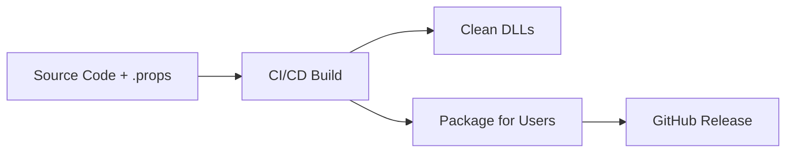

# 📦 Per Aspera Mod Distribution Strategy

## 🎯 Two-Tier Distribution System

### 🛠️ Developer Tier (Current Setup)
**For mod creators and contributors:**
- Full source code with `.props` configuration
- SDK integration and build system
- CI/CD pipelines and development tools
- Documentation and technical references

### 🎮 Player Tier (End-User Distribution)
**For players who just want to install and play:**
- Clean DLL files only (no .props, no source)
- Automated installers
- Steam Workshop integration
- Drag-and-drop installation

---

## 🚀 Distribution Channels

### 1. GitHub Releases (Automated)
```yaml
# Generated by CI/CD pipeline
release/
├── PerAspera-ModPack-v1.0.0.zip        # Complete mod pack
├── AtmosphereRelease-v1.0.0.zip         # Individual mods
├── MasterGui-v1.0.0.zip
├── SolarPowerOverride-v1.0.0.zip
└── INSTALL.md                           # Simple installation guide
```

**What users get:**
- Clean DLL files
- Simple installation instructions
- No development dependencies
- No .props files

### 2. Steam Workshop (Future)
```
Steam Workshop Package:
├── mod.dll                    # Compiled mod
├── manifest.yaml             # Steam Workshop manifest
├── preview.png              # Mod preview image
└── description.txt          # User-friendly description
```

### 3. ModPeraspera Installer (Future Tool)
```powershell
# One-command installation for users
.\Install-PerAsperaMods.ps1 -ModPack "v1.0.0"
# Downloads, extracts, and installs to correct BepInEx folder
```

---

## 🧹 Clean Distribution Process

### Phase 1: Build (CI/CD)


### Phase 2: User Installation


---

## 📝 User Installation Guide

### Simple Installation (No Technical Knowledge Required)

1. **Download the mod pack:**
   - Go to [Releases](https://github.com/PerAsperaMods/ModPeraspera/releases)
   - Download `PerAspera-ModPack-vX.X.X.zip`

2. **Install:**
   ```
   Extract the zip to:
   Steam/steamapps/common/Per Aspera/BepInEx/plugins/
   ```

3. **Launch the game:**
   - Mods are automatically loaded
   - No configuration needed

### What Users DON'T Need:
- ❌ Visual Studio or development tools
- ❌ .NET SDK installation
- ❌ Understanding of .props files
- ❌ GitHub repositories cloning
- ❌ Build processes

### What Users GET:
- ✅ Clean DLL files ready to use
- ✅ Simple drag-and-drop installation
- ✅ Automatic mod loading
- ✅ User-friendly documentation

---

## 🔧 Technical Implementation

### CI/CD Clean Distribution
```yaml
# In .github/workflows/release.yml
- name: Create Clean User Distribution
  run: |
    # Create user-friendly package structure
    New-Item -ItemType Directory -Path "user-distribution" -Force
    
    # Copy only DLLs and essential files
    Get-ChildItem -Path "*/bin/Release/*.dll" | ForEach-Object {
      Copy-Item $_ -Destination "user-distribution/"
    }
    
    # Create installation guide
    Copy-Item "INSTALL-USER.md" -Destination "user-distribution/INSTALL.md"
    
    # Package for end users
    Compress-Archive -Path "user-distribution/*" -DestinationPath "release/PerAspera-UserMods-v$version.zip"
```

### Directory Separation
```
# Development Repository (Github)
ModPeraspera/                    # Full development environment
├── .props files                # Build configuration
├── SDK/                        # Development SDK
├── Individual-Mods/            # Source code
└── Tools/                      # Development tools

# User Distribution (Downloads)
PerAspera-UserMods-v1.0.0/      # Clean user package  
├── AtmosphereRelease.dll       # Ready-to-use mods
├── MasterGui.dll
├── SolarPowerOverride.dll
└── INSTALL.md                  # Simple guide
```

---

## 🎯 Advantages of Two-Tier System

### For Developers:
- **Full Control**: Access to all build tools and configuration
- **SDK Integration**: Native API development with documented classes
- **CI/CD Automation**: Automated builds and releases
- **Community Contribution**: Easy fork and contribute workflow

### For Players:
- **Simplicity**: Download, extract, play
- **No Technical Barriers**: No development tools required
- **Reliability**: Pre-built, tested DLL files
- **Clean Installation**: No clutter, no confusion

### For Project:
- **Clear Separation**: Development complexity hidden from users
- **Professional Distribution**: Steam Workshop ready
- **Scalability**: Easy to add new distribution channels
- **Maintainability**: Users don't break builds with config changes

---

## 🚀 Immediate Implementation Plan

1. **Update CI/CD** to create clean user packages
2. **Create INSTALL-USER.md** with simple instructions
3. **Test user distribution** with minimal technical knowledge
4. **Steam Workshop integration** planning
5. **Auto-installer tool** development for advanced users

This ensures **developers have full SDK power** while **players get hassle-free mod installation**.