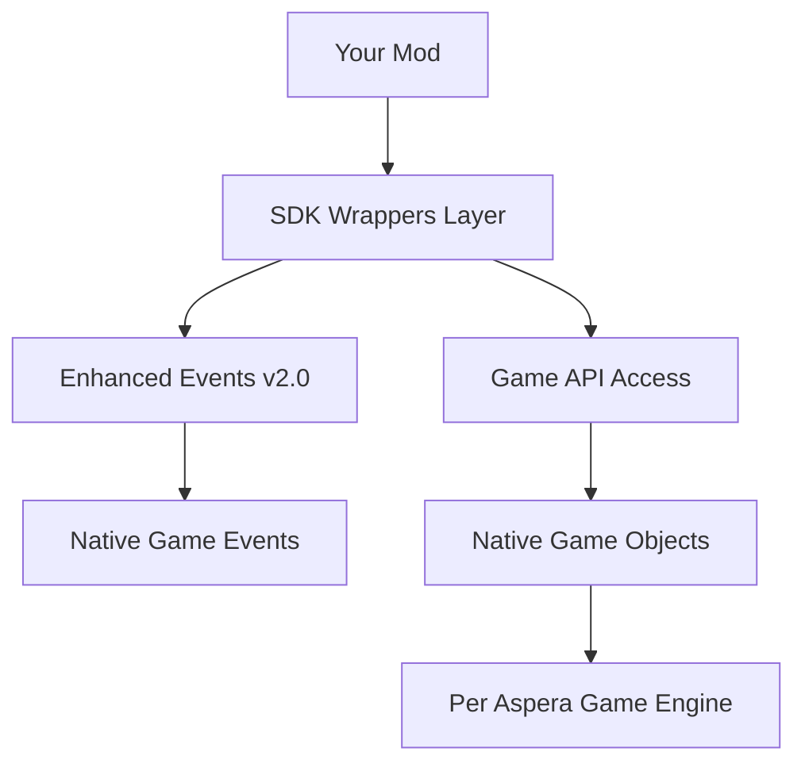
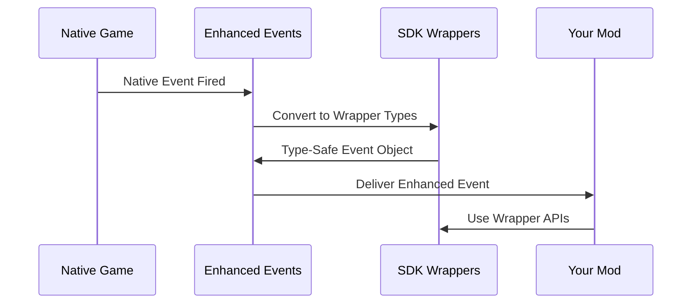

# �️ Wrapper Architecture Reference - SDK v2.0

**📋 Complete Technical Reference** for Per Aspera SDK v2.0 wrapper architecture, Enhanced Events system, and SDK-only template patterns.

## 📋 Table of Contents

1. [SDK v2.0 Template Structure](#sdk-v20-template-structure)
2. [Enhanced Events v2.0 System](#enhanced-events-v20-system) 
3. [Core Wrapper Classes](#core-wrapper-classes)
4. [Event Subscription Patterns](#event-subscription-patterns)
5. [Migration from Legacy Systems](#migration-from-legacy-systems)
6. [Performance Best Practices](#performance-best-practices)

---

## 🎯 SDK v2.0 Template Structure

### Required Using Statements

**✅ CRITICAL**: For all SDK-only mods, include these using statements:

```csharp
using BepInEx;
using BepInEx.Unity.IL2CPP;              // ✅ REQUIRED for BasePlugin
using BepInEx.Logging;
using PerAspera.ModSDK;
using PerAspera.GameAPI.Wrappers;
using PerAspera.GameAPI.Events.SDK;      // ✅ REQUIRED for Enhanced Events v2.0
using PerAspera.GameAPI.Events.Data;
using PerAspera.GameAPI.Events.Integration; // ✅ AJOUTÉ - EnhancedEventBus
using System.IO;                         // ✅ AJOUTÉ - Unity libs path access
using System.Reflection;                 // ✅ AJOUTÉ - Unity dynamic loading
```

### **🎯 Unity Input Integration (NOUVEAU)**

**DÉCOUVERTE CRITIQUE**: Unity APIs réelles disponibles via `unity-libs/`

```csharp
// ✅ PATTERN VALIDÉ - Unity Input via unity-libs
public static class UnityInputWrapper
{
    private static string UnityLibsPath = Path.Combine(
        Environment.GetFolderPath(Environment.SpecialFolder.LocalApplicationData),
        "BepInEx", "unity-libs");
        
    private static Assembly? _unityEngineAssembly;
    private static System.Type? _inputType;
    
    static UnityInputWrapper()
    {
        LoadUnityInput();
    }
    
    public static bool SafeGetKeyDown(KeyCode keyCode)
    {
        try
        {
            if (_inputType == null) return false;
            
            var getKeyDownMethod = _inputType.GetMethod("GetKeyDown", 
                new[] { typeof(KeyCode) });
                
            if (getKeyDownMethod != null)
            {
                var result = (bool)getKeyDownMethod.Invoke(null, new object[] { keyCode });
                
                if (result)
                {
                    LogAspera.Success($"🎯 {keyCode} detected via UnityInputWrapper!");
                }
                
                return result;
            }
        }
        catch (Exception ex)
        {
            LogAspera.Error($"❌ Unity Input error for {keyCode}: {ex.Message}");
        }
        
        return false;
    }
}
```

### Project Template (.csproj)

**✅ SDK-Only Template**: Single import line replaces manual references

```xml
<Project Sdk="Microsoft.NET.Sdk">
  <PropertyGroup>
    <TargetFramework>net6.0</TargetFramework>
    <AssemblyName>YourMod.AssemblyName</AssemblyName>
    <AllowUnsafeBlocks>true</AllowUnsafeBlocks>
    <LangVersion>latest</LangVersion>
    <Nullable>enable</Nullable>
  </PropertyGroup>

  <!-- 🎯 SDK-ONLY TEMPLATE - SINGLE DEPENDENCY -->
  <Import Project="$(MSBuildThisFileDirectory)..\..\SDK_DLL\sdkDLL.props" />
  
  <!-- Additional packages only if needed -->
  <ItemGroup>
    <!-- Example: TwitchLib for streaming integration -->
    <!-- <PackageReference Include="TwitchLib.Client" Version="3.3.1" /> -->
  </ItemGroup>
</Project>
```

### Base Plugin Class Pattern

**✅ SDK v2.0 Lifecycle**: BasePlugin + Enhanced Events

```csharp
namespace YourMod.Namespace
{
    /// <summary>
    /// Your mod description
    /// </summary>
    [BepInPlugin(MyPluginInfo.PLUGIN_GUID, MyPluginInfo.PLUGIN_NAME, MyPluginInfo.PLUGIN_VERSION)]
    public class YourModPlugin : PerAsperaSDKPlugin  // ✅ SDK-only base class
    {
        public override void Load()
        {
            try 
            {
                Log.LogInfo($"Loading {MyPluginInfo.PLUGIN_NAME} v{MyPluginInfo.PLUGIN_VERSION}");
                
                // Initialize configurations
                SetupConfiguration();
                
                Log.LogInfo($"{MyPluginInfo.PLUGIN_NAME} loaded successfully");
            }
            catch (Exception ex)
            {
                Log.LogError($"Failed to load {MyPluginInfo.PLUGIN_NAME}: {ex.Message}");
            }
        }

        public override bool Unload()
        {
            try
            {
                Log.LogInfo($"Unloading {MyPluginInfo.PLUGIN_NAME}");
                
                // Cleanup resources
                CleanupResources();
                
                return true;
            }
            catch (Exception ex)
            {
                Log.LogError($"Failed to unload {MyPluginInfo.PLUGIN_NAME}: {ex.Message}");
                return false;
            }
        }

        protected override void OnSDKReady()
        {
            // Subscribe to game events using Enhanced Events v2.0
            SetupEventSubscriptions();
        }
    }
}
```

---

## 🎯 Enhanced Events v2.0 System

### Core Event Subscription Pattern

**✅ NEW**: Enhanced Events replace direct SDK event access

```csharp
protected override void OnSDKReady()
{
    // Game lifecycle events
    EnhancedEvents.Subscribe<GameFullyLoadedEvent>(SDKEventConstants.GameFullyLoaded, OnGameLoaded);
    
    // Time and calendar events  
    EnhancedEvents.Subscribe<MartianDayEvent>(SDKEventConstants.MartianDayChanged, OnDayChanged);
    EnhancedEvents.Subscribe<SeasonChangedEvent>(SDKEventConstants.SeasonChanged, OnSeasonChanged);
    
    // Climate and atmosphere events
    EnhancedEvents.Subscribe<ClimateAnalysisEvent>(SDKEventConstants.ClimateAnalysisComplete, OnClimateUpdate);
    EnhancedEvents.Subscribe<TemperatureChangedEvent>(SDKEventConstants.TemperatureChanged, OnTemperatureChanged);
    
    // Building and construction events
    EnhancedEvents.Subscribe<BuildingSpawnedEvent>(SDKEventConstants.BuildingSpawned, OnBuildingSpawned);
    EnhancedEvents.Subscribe<BuildingDespawnedEvent>(SDKEventConstants.BuildingDespawned, OnBuildingDespawned);
    
    // Research and technology events
    EnhancedEvents.Subscribe<TechnologyResearchedEvent>(SDKEventConstants.TechnologyResearched, OnTechnologyCompleted);
    
    // Resource and economy events
    EnhancedEvents.Subscribe<ResourceChangedEvent>(SDKEventConstants.ResourceChanged, OnResourceChanged);
}
            try
            {
                // Store wrapper references
                _baseGame = evt.BaseGameWrapper;
                _universe = evt.UniverseWrapper;
                _planet = evt.PlanetWrapper;
                
                Log.Info($"✅ Game wrappers received: Planet={_planet?.Name}");
                
                // Your mod logic here
                InitializeYourMod();
                
                Log.Info("🌟 Your Mod active!");
            }
            catch (Exception ex)
            {
                Log.Error($"❌ Error activating mod: {ex.Message}");
            }
        }
        
        private void InitializeYourMod()
        {
            if (_planet?.Atmosphere == null) return;
            
            // Example: Access planet data
            var atmosphere = _planet.Atmosphere;
            Log.Info($"🌡️ Planet {_planet.Name} temperature: {atmosphere.Temperature:F1}°C");
            
            // Example: Access buildings
            var buildings = _planet.GetBuildings();
            Log.Info($"🏗️ Total buildings: {buildings?.Count() ?? 0}");
            
            // Your implementation here...
        }
        
        public override bool Unload()
        {
            Log.Info("Your Mod unloaded");
            return true;
        }
    }
}
```

## 📋 **Complete .csproj Template (Updated)**

```xml
<Project Sdk="Microsoft.NET.Sdk">

  <PropertyGroup>
    <TargetFramework>net6.0</TargetFramework>
    <AssemblyName>YourModName</AssemblyName>
    <RootNamespace>YourMod.Namespace</RootNamespace>
    <LangVersion>latest</LangVersion>
    <Nullable>enable</Nullable>
    <AllowUnsafeBlocks>true</AllowUnsafeBlocks>
  </PropertyGroup>

  <!-- 🎯 SDK-ONLY TEMPLATE - SINGLE DEPENDENCY -->
  <Import Project="$(MSBuildThisFileDirectory)..\..\SDK_DLL\sdkDLL.props" />

  <!-- Optional: Auto-deploy to game on build -->
  <Target Name="DeployToGame" AfterTargets="Build">
    <Copy 
      SourceFiles="$(TargetPath)" 
      DestinationFolder="F:\SteamLibrary\steamapps\common\Per Aspera\BepInEx\plugins\" 
      SkipUnchangedFiles="true" />
  </Target>

</Project>
```

---

# 🎯 Wrapper Architecture & Event System Reference

**Last Updated**: 2025-12-18  
**Architecture Version**: SDK v2.0 with Enhanced Events

---

## 🏗️ **SDK-Only Architecture Overview**

The Per Aspera SDK now uses a **unified wrapper architecture** that provides:

- ✅ **Type-safe access** to all game objects
- ✅ **Automatic event conversion** from native to wrapper types  
- ✅ **Zero duplication** dependencies via `sdkDLL.props`
- ✅ **Future extensibility** for multi-planet modding

### **Architecture Layers**



---

## 🎮 **Core Wrapper Classes**

### **BaseGame Wrapper**
**Purpose**: Central game instance and lifecycle management

```csharp
using BaseGameWrapper = PerAspera.GameAPI.Wrappers.BaseGame;

// Access via Enhanced Events
EnhancedEvents.Subscribe<GameFullyLoadedEvent>(SDKEventConstants.GameFullyLoaded, evt => {
    var baseGame = evt.BaseGameWrapper;
    var universe = evt.UniverseWrapper;
    var planet = evt.PlanetWrapper;
    
    // Safe wrapper access - no NativeInstance needed
    LogAspera.Info($"Game loaded on planet: {planet.Name}"); // "Mars"
});
```

**Key Properties:**
- `Version` - Game version info
- `IsPaused` - Pause state
- `GameTime` - Current game timestamp

### **Planet Wrapper**
**Purpose**: Planetary data and terraforming systems

```csharp
using PlanetWrapper = PerAspera.GameAPI.Wrappers.Planet;

// Enhanced for multi-planet extensibility
var planet = evt.PlanetWrapper;

// NEW: Planet identity support
var planetName = planet.Name; // "Mars" (hardcoded, extensible for future)

// Atmosphere access
var atmosphere = planet.Atmosphere;
var temperature = atmosphere.Temperature;
var pressure = atmosphere.Pressure;

// Building management
var buildings = planet.GetBuildings();
var solarPanels = buildings.Where(b => b.BuildingType.Name == "SolarPanel");
```

**Key Properties:**
- `Name` - Planet identifier ("Mars" for Per Aspera, extensible)
- `Atmosphere` - Climate and atmospheric data
- `Buildings` - All structures on planet
- `Resources` - Resource networks and flows

### **Universe Wrapper**
**Purpose**: Galaxy-wide systems and faction management

```csharp
using UniverseWrapper = PerAspera.GameAPI.Wrappers.Universe;

var universe = evt.UniverseWrapper;

// Faction management
var playerFaction = universe.GetPlayerFaction();
var allFactions = universe.GetFactions();

// Multi-planet support (future)
var currentPlanet = universe.CurrentPlanet; // Mars
```

---

## 🚀 **Enhanced Events v2.0 Pattern**

### **Event Subscription Pattern**
```csharp
using PerAspera.GameAPI.Events;
using PerAspera.GameAPI.Events.Constants;

// Type-safe event subscription
EnhancedEvents.Subscribe<GameFullyLoadedEvent>(
    SDKEventConstants.GameFullyLoaded, 
    evt =>
    {
        // Automatic wrapper conversion - no casting needed
        var baseGame = evt.BaseGameWrapper;   // Type: BaseGameWrapper
        var universe = evt.UniverseWrapper;   // Type: UniverseWrapper
        var planet = evt.PlanetWrapper;       // Type: PlanetWrapper
        
        // Direct API access with IntelliSense
        LogAspera.Info($"Game loaded on {planet.Name}");
        LogAspera.Info($"Buildings: {planet.GetBuildings().Count()}");
    }
);
```

### **Event Lifecycle**



---

## 🔧 **Harmony Patches with Wrappers**

### **Wrapper Approach for Patches**
When SDK coverage is insufficient, use wrapper classes in Harmony patches:

```csharp
using HarmonyLib;
using BaseGameWrapper = PerAspera.GameAPI.Wrappers.BaseGame;

[HarmonyPatch(typeof(BaseGameWrapper), nameof(BaseGameWrapper.OnFinishLoading))]
public static class OnFinishLoadingPatch
{
    [HarmonyPostfix]
    public static void Postfix()
    {
        // Patch via wrapper - maintains SDK compatibility
        LogAspera.Info("Game loading completed via wrapper patch");
        
        // Trigger your mod's initialization
        YourMod.OnGameLoaded();
    }
}
```

**Benefits:**
- ✅ **SDK compatibility maintained** - Works with wrapper APIs
- ✅ **Type safety preserved** - No IL2CPP interop issues
- ✅ **Future-proof** - Updates with wrapper improvements

---

## 📋 **Migration from Native Access**

### **BEFORE: Direct Native Access (Deprecated)**
```csharp
// ❌ OLD APPROACH - AVOID
[HarmonyPatch(typeof(BaseGame), nameof(BaseGame.OnFinishLoading))]
public static class NativePatch 
{
    // Direct native access - fragile, no type safety
}
```

### **AFTER: SDK Wrapper Approach (Current)**
```csharp
// ✅ NEW APPROACH - RECOMMENDED
[HarmonyPatch(typeof(BaseGameWrapper), nameof(BaseGameWrapper.OnFinishLoading))]
public static class WrapperPatch 
{
    // Wrapper access - type-safe, SDK-compatible
}
```

---

## 🎯 **Best Practices**

### **1. Always Use Wrappers**
```csharp
// ✅ Good - SDK wrapper
using PlanetWrapper = PerAspera.GameAPI.Wrappers.Planet;

// ❌ Avoid - Direct native access
// var nativePlanet = BaseGame.Instance.universe.currentPlanet;
```

### **2. Subscribe to Enhanced Events**
```csharp
// ✅ Good - Enhanced Events v2.0
EnhancedEvents.Subscribe<GameFullyLoadedEvent>(SDKEventConstants.GameFullyLoaded, evt => { ... });

// ❌ Avoid - Legacy event system
// EventSystem.Subscribe("game.loaded", (object data) => { ... });
```

### **3. Handle Wrapper Nulls Safely**
```csharp
// ✅ Good - Null-safe wrapper access
var planet = evt.PlanetWrapper;
if (planet != null)
{
    var name = planet.Name; // Safe access
}
```

### **4. Use LogAspera for Consistent Logging**
```csharp
// ✅ Good - SDK logging
var log = new LogAspera("YourMod");
log.Info($"Planet loaded: {planet.Name}");

// ❌ Avoid - Direct BepInEx logging in wrapper context
// Logger.LogInfo($"Planet: {planet}"); 
```

---

## 🚀 **Future Extensibility**

### **Multi-Planet Support Ready**
```csharp
// Current: Hardcoded Mars
var planetName = planet.Name; // "Mars"

// Future: Dynamic planet detection
// var planetName = planet.Name; // "Mars", "Earth", "Venus", etc.
// var planetType = planet.Type; // Terrestrial, Gas Giant, etc.
```

### **Faction System Expansion**
```csharp
// Current: Basic faction access
var factions = universe.GetFactions();

// Future: Rich faction interactions
// var relations = universe.GetFactionRelations(playerFaction);
// var diplomacy = universe.GetDiplomacyState();
```

---

## 📚 **Additional Resources**

- **[First Mod Tutorial](getting-started/First-Mod.md)** - Hands-on SDK usage
- **[Event System Reference](Event-System-Quick-Reference.md)** - Complete event catalog
- **[SDK Components Overview](architecture/SDK-Components.md)** - Full SDK architecture
- **[Performance Guide](advanced/Performance.md)** - Optimization patterns

---

**🎯 This architecture provides a solid foundation for Per Aspera modding with type safety, extensibility, and performance in mind.**