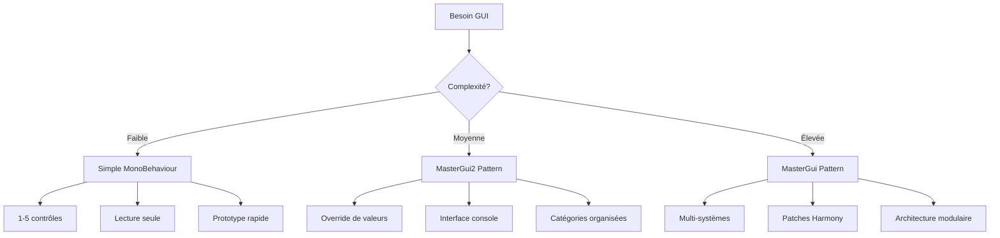

# 🎮 Guide Implémentation GUI Per Aspera - De Zéro au Livrable

## 📚 Introduction

Ce guide décrit la méthodologie complète pour implémenter une interface graphique Unity dans Per Aspera, de la conception initiale jusqu'au livrable fonctionnel. Basé sur l'analyse des projets MasterGui et MasterGui2 validés.

---

## 🎯 Réflexion Initiale : Définir les Objectifs

### 1️⃣ **Analyse des Besoins**

#### Questions Fondamentales
- **🎮 Quel est l'objectif de l'interface ?**
  - Panneau de contrôle de paramètres de jeu
  - Interface complète multi-systèmes
  - Overlay d'information en temps réel
  - Debug/développement tools

- **👤 Qui est l'utilisateur cible ?**
  - Joueur casual (interface simple)
  - Power user (contrôles avancés)
  - Développeur de mods (outils debug)
  - Testeur/QA (accès complet)

- **⚡ Quelle complexité acceptée ?**
  - Interface légère (quelques contrôles)
  - Interface moyenne (catégories organisées)
  - Interface complexe (multi-fenêtres, tabs)

#### Exemples de Use Cases

```yaml
# Use Case 1: Panneau de Contrôle Simple
Objectif: "Modifier les paramètres d'énergie en temps réel"
Cible: "Joueur expérimenté"
Complexité: "Faible - 5-10 contrôles"
Pattern: "MasterGui2 simplifié"

# Use Case 2: Interface de Debug Complète  
Objectif: "Accès complet aux systèmes de jeu pour debug"
Cible: "Développeur/modder"
Complexité: "Élevée - multi-systèmes"
Pattern: "MasterGui modulaire"

# Use Case 3: Overlay d'Information
Objectif: "Affichage d'informations système en overlay"
Cible: "Tous joueurs"
Complexité: "Minimale - lecture seule"
Pattern: "MonoBehaviour simple"
```

### 2️⃣ **Choix Architectural**

#### Matrice de Décision

| Critère | Simple MonoBehaviour | MasterGui2 Pattern | MasterGui Pattern |
|---------|---------------------|-------------------|------------------|
| **Temps dev** | 1-2 jours | 3-5 jours | 1-2 semaines |
| **Extensibilité** | Faible | Moyenne | Élevée |
| **Maintenance** | Facile | Modérée | Complexe |
| **Performance** | Optimale | Bonne | Moyenne |
| **SDK Integration** | Basique | Complète | Avancée |
| **Use Cases** | Overlay simple | Contrôle paramètres | Interface complète |

#### Recommandations par Projet



---

## 🏗️ Phase 1: Architecture et Setup

### 1️⃣ **Création de la Structure Projet**

```bash
# Structure recommandée
MyCustomGui/
├── MyCustomGuiPlugin.cs        # Plugin principal BasePlugin
├── UI/
│   ├── GuiBehaviour.cs         # MonoBehaviour Unity
│   ├── GuiRenderer.cs          # Logique rendu OnGUI()
│   └── GuiStyles.cs           # Styles personnalisés
├── Systems/
│   ├── OverrideManager.cs     # Si système d'override
│   └── ConfigManager.cs       # Configuration persistante
├── Helpers/
│   └── GuiHelper.cs           # Helpers spécialisés
└── MyCustomGui.csproj         # Configuration projet
```

### 2️⃣ **Configuration Projet (.csproj)**

```xml
<Project Sdk="Microsoft.NET.Sdk">

  <PropertyGroup>
    <TargetFramework>net6.0</TargetFramework>
    <AssemblyTitle>My Custom GUI</AssemblyTitle>
    <AssemblyDescription>Custom GUI interface for Per Aspera</AssemblyDescription>
    <AssemblyVersion>1.0.0.0</AssemblyVersion>
    <FileVersion>1.0.0.0</FileVersion>
  </PropertyGroup>

  <ItemGroup>
    <PackageReference Include="BepInEx.PluginInfoProps" Version="2.*" />
    <PackageReference Include="BepInEx.Unity.IL2CPP" Version="6.0.0-be.*" />
  </ItemGroup>

  <ItemGroup>
    <ProjectReference Include="..\..\SDK\PerAspera.ModSDK\PerAspera.ModSDK.csproj" />
    <ProjectReference Include="..\..\SDK\PerAspera.Core\PerAspera.Core.csproj" />
    <ProjectReference Include="..\..\SDK\PerAspera.GameAPI\PerAspera.GameAPI.csproj" />
  </ItemGroup>

  <!-- Post-build copy vers BepInEx -->
  <Target Name="PostBuild" AfterTargets="PostBuildEvent">
    <Copy SourceFiles="$(OutDir)$(AssemblyName).dll" 
          DestinationFolder="F:\SteamLibrary\steamapps\common\Per Aspera\BepInEx\plugins\$(AssemblyName)\" 
          ContinueOnError="false" />
  </Target>

</Project>
```

---

## 🔧 Phase 2: Implémentation Core

### 1️⃣ **Plugin Principal - Pattern Validé**

```csharp
using BepInEx;
using BepInEx.Unity.IL2CPP;
using PerAspera.ModSDK;
using MyCustomGui.UI;

namespace MyCustomGui
{
    [BepInPlugin("com.author.mycustomgui", "My Custom GUI", "1.0.0")]
    [BepInDependency("peraaspera.modsdk", BepInDependency.DependencyFlags.HardDependency)]
    public class MyCustomGuiPlugin : BasePlugin
    {
        public static BepInEx.Logging.ManualLogSource Logger { get; private set; }

        public override void Load()
        {
            Logger = Log;
            Log.LogInfo("🚀 My Custom GUI Loading...");

            try
            {
                // 1. Initialiser ModSDK
                ModSDK.Initialize("MyCustomGui", "1.0.0");
                Log.LogInfo("✅ ModSDK initialized");

                // 2. S'abonner aux événements
                ModSDK.EventManager.Subscribe("BaseGameReady", OnBaseGameReady);
                Log.LogInfo("📝 Subscribed to BaseGameReady event");

                // 3. Initialisation immédiate (optionnel)
                InitializePlugin();
                
            }
            catch (System.Exception ex)
            {
                Log.LogError($"❌ Failed to initialize: {ex.Message}");
                Log.LogError(ex.StackTrace);
            }
        }

        private void OnBaseGameReady(object eventData)
        {
            try
            {
                Log.LogInfo("🎮 BaseGame ready - Spawning GUI");
                
                // Spawner l'interface quand le jeu est prêt
                GuiBehaviour.Spawn();
                
                Log.LogInfo("✅ GUI spawned successfully");
            }
            catch (System.Exception ex)
            {
                Log.LogError($"❌ Failed to spawn GUI: {ex.Message}");
            }
        }

        private void InitializePlugin()
        {
            // Initialisation des systèmes qui ne dépendent pas du jeu
            Log.LogInfo("🎯 Core systems initialized");
        }
    }
}
```

### 2️⃣ **MonoBehaviour Unity - Pattern IL2CPP**

```csharp
using UnityEngine;
using Il2CppInterop.Runtime.Injection;
using BepInEx.Logging;

namespace MyCustomGui.UI
{
    public class GuiBehaviour : MonoBehaviour
    {
        private static bool s_spawned = false;
        private static ManualLogSource Logger => MyCustomGuiPlugin.Logger;
        
        private GuiRenderer _renderer;
        private bool _initialized = false;

        // Configuration
        private KeyCode _toggleKey = KeyCode.F8;  // Personnalisable
        private bool _showGui = false;

        /// <summary>
        /// Point d'entrée principal - Spawn de l'interface
        /// </summary>
        public static void Spawn()
        {
            if (s_spawned)
            {
                Logger.LogInfo("GUI already spawned");
                return;
            }

            try
            {
                // ÉTAPE CRITIQUE : Enregistrer le type IL2CPP
                ClassInjector.RegisterTypeInIl2Cpp<GuiBehaviour>();
                Logger.LogInfo("GuiBehaviour registered in IL2CPP");

                // Créer GameObject persistant
                var guiObject = new GameObject("MyCustomGui_Interface");
                GameObject.DontDestroyOnLoad(guiObject);
                
                // Attacher le comportement
                var behaviour = guiObject.AddComponent<GuiBehaviour>();
                Logger.LogInfo("GameObject created and configured");

                s_spawned = true;
                Logger.LogInfo($"GUI spawned - Press {KeyCode.F8} to toggle");
            }
            catch (System.Exception ex)
            {
                Logger.LogError($"Error spawning GUI: {ex.Message}");
                Logger.LogError(ex.StackTrace);
            }
        }

        #region Unity Lifecycle

        private void Start()
        {
            try
            {
                InitializeGui();
                _initialized = true;
                Logger.LogInfo("GUI initialized successfully");
            }
            catch (System.Exception ex)
            {
                Logger.LogError($"GUI initialization failed: {ex.Message}");
            }
        }

        private void Update()
        {
            if (!_initialized) return;

            try
            {
                HandleInput();
                UpdateGuiState();
            }
            catch (System.Exception ex)
            {
                Logger.LogError($"GUI update error: {ex.Message}");
            }
        }

        private void OnGUI()
        {
            if (!_initialized || !_showGui) return;

            try
            {
                _renderer?.Render();
            }
            catch (System.Exception ex)
            {
                Logger.LogError($"GUI render error: {ex.Message}");
            }
        }

        #endregion

        #region GUI Management

        private void InitializeGui()
        {
            _renderer = new GuiRenderer();
            Logger.LogInfo("GUI renderer created");
        }

        private void HandleInput()
        {
            // Toggle principal
            if (UnityEngine.Input.GetKeyDown(_toggleKey))
            {
                ToggleGui();
            }

            // Raccourcis supplémentaires
            if (_showGui)
            {
                // Save config (Ctrl+S)
                if (UnityEngine.Input.GetKey(KeyCode.LeftControl) && 
                    UnityEngine.Input.GetKeyDown(KeyCode.S))
                {
                    SaveConfiguration();
                }

                // Reset (Ctrl+R)
                if (UnityEngine.Input.GetKey(KeyCode.LeftControl) && 
                    UnityEngine.Input.GetKeyDown(KeyCode.R))
                {
                    ResetToDefaults();
                }
            }
        }

        private void UpdateGuiState()
        {
            // Auto-hide si jeu en pause
            if (BaseGame.Instance?.isPaused == true && _showGui)
            {
                Logger.LogInfo("Game paused - hiding GUI");
                _showGui = false;
            }
        }

        private void ToggleGui()
        {
            _showGui = !_showGui;
            Logger.LogInfo($"GUI toggled: {(_showGui ? "shown" : "hidden")}");
            
            if (_showGui)
            {
                _renderer?.OnGuiShown();
            }
            else
            {
                _renderer?.OnGuiHidden();
            }
        }

        private void SaveConfiguration()
        {
            // TODO: Implémenter sauvegarde configuration
            Logger.LogInfo("Configuration saved");
        }

        private void ResetToDefaults()
        {
            // TODO: Implémenter reset
            Logger.LogInfo("Reset to defaults");
        }

        #endregion
    }
}
```

### 3️⃣ **Renderer OnGUI() - Pattern Modulaire**

```csharp
using UnityEngine;
using System.Collections.Generic;

namespace MyCustomGui.UI
{
    public class GuiRenderer
    {
        private Rect _windowRect = new Rect(50, 50, 400, 600);
        private Vector2 _scrollPos;
        private bool _isDragging = false;
        
        // État interne
        private Dictionary<string, bool> _categoryExpanded = new();
        private GUISkin _customSkin;

        public GuiRenderer()
        {
            InitializeStyles();
            InitializeCategories();
        }

        public void Render()
        {
            // Application du skin personnalisé
            var previousSkin = GUI.skin;
            if (_customSkin != null) GUI.skin = _customSkin;

            try
            {
                // Fenêtre principale
                _windowRect = GUI.Window(
                    id: 12345,
                    clientRect: _windowRect,
                    func: DrawMainWindow,
                    text: "🎮 My Custom GUI v1.0"
                );
            }
            finally
            {
                GUI.skin = previousSkin;
            }
        }

        private void DrawMainWindow(int windowId)
        {
            GUILayout.BeginVertical();

            // Header avec infos
            DrawHeader();

            // Zone de scroll principale
            _scrollPos = GUILayout.BeginScrollView(_scrollPos);

            // Contenu principal organisé par catégories
            DrawMainContent();

            GUILayout.EndScrollView();

            // Footer avec actions
            DrawFooter();

            GUILayout.EndVertical();

            // Permettre le drag
            GUI.DragWindow();
        }

        private void DrawHeader()
        {
            GUILayout.BeginHorizontal("box");
            
            GUILayout.Label("🎯 Status:", GUILayout.Width(60));
            
            var statusColor = IsGameReady() ? Color.green : Color.red;
            var statusText = IsGameReady() ? "Ready" : "Not Ready";
            
            var style = new GUIStyle(GUI.skin.label) { normal = { textColor = statusColor } };
            GUILayout.Label(statusText, style);
            
            GUILayout.FlexibleSpace();
            
            if (GUILayout.Button("❌", GUILayout.Width(30)))
            {
                // Fermer GUI
                GuiBehaviour.ToggleGui();
            }
            
            GUILayout.EndHorizontal();
        }

        private void DrawMainContent()
        {
            // Exemple de contenu catégorisé
            DrawCategorySection("⚡ Energy Controls", () => {
                DrawEnergyControls();
            });

            DrawCategorySection("🌡️ Climate Controls", () => {
                DrawClimateControls();
            });

            DrawCategorySection("🏗️ Building Controls", () => {
                DrawBuildingControls();
            });

            DrawCategorySection("ℹ️ Information", () => {
                DrawInformation();
            });
        }

        private void DrawCategorySection(string categoryName, System.Action drawContent)
        {
            // Bouton pliable
            _categoryExpanded[categoryName] = DrawCollapsibleHeader(
                categoryName, 
                _categoryExpanded.GetValueOrDefault(categoryName, true)
            );

            if (_categoryExpanded[categoryName])
            {
                GUILayout.BeginVertical("box");
                drawContent?.Invoke();
                GUILayout.EndVertical();
            }

            GUILayout.Space(5);
        }

        private bool DrawCollapsibleHeader(string title, bool expanded)
        {
            var style = new GUIStyle(GUI.skin.button)
            {
                alignment = TextAnchor.MiddleLeft,
                fontStyle = FontStyle.Bold
            };

            string arrow = expanded ? "▼" : "▶";
            bool clicked = GUILayout.Button($"{arrow} {title}", style);

            return clicked ? !expanded : expanded;
        }

        private void DrawEnergyControls()
        {
            GUILayout.Label("⚡ Energy System Controls", EditorStyles.boldLabel);
            
            // Contrôles d'énergie
            DrawSliderControl("Solar Efficiency", 0.1f, 5.0f, 1.0f, "x");
            DrawSliderControl("Wind Power Multiplier", 0.1f, 3.0f, 1.0f, "x");
            DrawSliderControl("Power Consumption", 0.1f, 2.0f, 1.0f, "x");
        }

        private void DrawClimateControls()
        {
            GUILayout.Label("🌡️ Climate System Controls", EditorStyles.boldLabel);
            
            DrawSliderControl("Temperature Factor", 0.5f, 2.0f, 1.0f, "x");
            DrawSliderControl("Pressure Multiplier", 0.5f, 2.0f, 1.0f, "x");
        }

        private void DrawBuildingControls()
        {
            GUILayout.Label("🏗️ Building System Controls", EditorStyles.boldLabel);
            
            DrawSliderControl("Construction Speed", 0.5f, 3.0f, 1.0f, "x");
            DrawSliderControl("Building Efficiency", 0.5f, 2.0f, 1.0f, "x");
        }

        private void DrawInformation()
        {
            GUILayout.Label("ℹ️ System Information", EditorStyles.boldLabel);
            
            // Informations du jeu
            var universe = PerAspera.ModSDK.ModSDK.Universe.GetPlanet();
            if (universe != null)
            {
                GUILayout.Label($"Planet: {universe.name ?? "Unknown"}");
                GUILayout.Label($"Sol: {PerAspera.ModSDK.ModSDK.Universe.GetCurrentSol()}");
                GUILayout.Label($"Buildings: {universe.buildings?.Count ?? 0}");
            }
            else
            {
                GUILayout.Label("⚠️ Game not ready");
            }
        }

        private float DrawSliderControl(string label, float min, float max, float current, string unit = "")
        {
            GUILayout.BeginHorizontal();
            
            GUILayout.Label($"{label}:", GUILayout.Width(150));
            
            float value = GUILayout.HorizontalSlider(current, min, max, GUILayout.Width(150));
            
            GUILayout.Label($"{value:F2}{unit}", GUILayout.Width(60));
            
            if (GUILayout.Button("R", GUILayout.Width(25)))
            {
                value = 1.0f; // Reset to default
            }
            
            GUILayout.EndHorizontal();
            
            return value;
        }

        private void DrawFooter()
        {
            GUILayout.BeginHorizontal();
            
            if (GUILayout.Button("💾 Save"))
            {
                // TODO: Save configuration
            }
            
            if (GUILayout.Button("🔄 Reset All"))
            {
                // TODO: Reset all values
            }
            
            GUILayout.FlexibleSpace();
            
            GUILayout.Label($"v1.0.0", EditorStyles.miniLabel);
            
            GUILayout.EndHorizontal();
        }

        private void InitializeStyles()
        {
            // TODO: Créer styles personnalisés
        }

        private void InitializeCategories()
        {
            _categoryExpanded["⚡ Energy Controls"] = true;
            _categoryExpanded["🌡️ Climate Controls"] = false;
            _categoryExpanded["🏗️ Building Controls"] = false;
            _categoryExpanded["ℹ️ Information"] = true;
        }

        private bool IsGameReady()
        {
            return BaseGame.Instance?.universe?.currentPlanet != null;
        }

        public void OnGuiShown()
        {
            // Actions à l'ouverture
        }

        public void OnGuiHidden()
        {
            // Actions à la fermeture
        }
    }
}
```

---

## 🧪 Phase 3: Tests et Validation

### 1️⃣ **Tests d'Intégration**

```csharp
// Tests à effectuer systématiquement
public class GuiTestManager
{
    public static void RunTests()
    {
        TestMonoBehaviourRegistration();
        TestGameObjectCreation();
        TestEventSubscription();
        TestGuiRendering();
        TestInputHandling();
        TestErrorRecovery();
    }

    private static void TestMonoBehaviourRegistration()
    {
        try
        {
            ClassInjector.RegisterTypeInIl2Cpp<GuiBehaviour>();
            Logger.LogInfo("✅ MonoBehaviour registration test passed");
        }
        catch (System.Exception ex)
        {
            Logger.LogError($"❌ MonoBehaviour registration test failed: {ex.Message}");
        }
    }

    // Autres tests...
}
```

### 2️⃣ **Checklist de Validation**

```markdown
## 🧪 Checklist Pré-Release

### ✅ Technical Validation
- [ ] Plugin se charge sans erreur
- [ ] MonoBehaviour s'enregistre correctement dans IL2CPP
- [ ] GameObject persiste entre les scènes
- [ ] GUI s'affiche correctement
- [ ] Inputs répondent (F8 toggle, raccourcis)
- [ ] Pas d'exception OnGUI
- [ ] Performance acceptable (< 1ms par frame)

### ✅ Functional Validation
- [ ] Contrôles modifient bien les valeurs du jeu
- [ ] État se sauvegarde entre sessions
- [ ] Reset fonctionne
- [ ] Interface s'adapte à différentes résolutions
- [ ] Compatible avec le système de pause du jeu

### ✅ User Experience
- [ ] Interface intuitive
- [ ] Feedback utilisateur clair
- [ ] Pas de conflit avec l'interface du jeu
- [ ] Raccourcis clavier documentés
- [ ] Messages d'erreur compréhensibles

### ✅ Integration Tests
- [ ] Compatible avec d'autres mods
- [ ] Pas d'interférence avec le SDK
- [ ] Fonctionne avec/sans d'autres plugins BepInX
- [ ] Performance stable sur sessions longues
```

---

## 🚀 Phase 4: Packaging et Livraison

### 1️⃣ **Structure de Release**

```
Release/
├── MyCustomGui.dll              # Plugin compilé
├── README.md                    # Documentation utilisateur  
├── CHANGELOG.md                 # Historique versions
├── LICENSE                      # Licence
└── Installation/
    ├── install.bat              # Script auto-installation
    └── BepInEx/
        └── plugins/
            └── MyCustomGui/
                └── MyCustomGui.dll
```

### 2️⃣ **Documentation Utilisateur (README.md)**

```markdown
# 🎮 My Custom GUI v1.0.0

Interface de contrôle personnalisée pour Per Aspera.

## ✨ Fonctionnalités

- **⚡ Contrôle Énergie**: Modifiez l'efficacité solaire/éolienne
- **🌡️ Contrôle Climat**: Ajustez température et pression
- **🏗️ Contrôle Bâtiments**: Vitesse construction et efficacité
- **💾 Sauvegarde**: Configuration persistante

## 🎯 Contrôles

- **F8**: Ouvrir/fermer l'interface
- **Ctrl+S**: Sauvegarder la configuration
- **Ctrl+R**: Reset toutes les valeurs

## 📦 Installation

### Automatique
1. Exécuter `install.bat`
2. Lancer le jeu

### Manuelle
1. Copier `MyCustomGui.dll` vers `Per Aspera/BepInEx/plugins/MyCustomGui/`
2. Lancer le jeu
3. Presser F8 pour ouvrir l'interface

## 🔧 Prérequis

- Per Aspera (dernière version)
- BepInEx 6.x IL2CPP

## 🐛 Dépannage

**Interface ne s'ouvre pas**
- Vérifier logs BepInEx : `BepInEx/LogOutput.log`
- Confirmer installation dans bon dossier

**Performance dégradée**
- Fermer interface si non utilisée (F8)
- Vérifier pas de conflit avec autres mods

## 📞 Support

- GitHub Issues: [URL]
- Discord: [Invitation]
```

### 3️⃣ **Scripts d'Installation**

```batch
@echo off
echo 🎮 MyCustomGui Installation Script
echo.

:: Detect Per Aspera installation
set "GAME_PATH="
for /f "tokens=2*" %%a in ('reg query "HKEY_LOCAL_MACHINE\SOFTWARE\Valve\Steam" /v "InstallPath" 2^>nul') do set "STEAM_PATH=%%b"

if exist "%STEAM_PATH%\steamapps\common\Per Aspera" (
    set "GAME_PATH=%STEAM_PATH%\steamapps\common\Per Aspera"
    echo ✅ Per Aspera trouvé: %GAME_PATH%
) else (
    echo ❌ Per Aspera non trouvé automatiquement
    set /p GAME_PATH=Entrez le chemin Per Aspera: 
)

:: Create target directory
set "TARGET_DIR=%GAME_PATH%\BepInEx\plugins\MyCustomGui"
if not exist "%TARGET_DIR%" mkdir "%TARGET_DIR%"

:: Copy files
echo 📦 Installation des fichiers...
copy "MyCustomGui.dll" "%TARGET_DIR%\" /Y
if %errorlevel% == 0 (
    echo ✅ Installation réussie!
    echo 🎯 Lancez Per Aspera et pressez F8
) else (
    echo ❌ Erreur installation
)

pause
```

### 4️⃣ **Automatisation CI/CD (GitHub Actions)**

```yaml
name: Build and Release

on:
  push:
    tags: [ 'v*' ]

jobs:
  build:
    runs-on: windows-latest
    
    steps:
    - uses: actions/checkout@v4
    
    - name: Setup .NET
      uses: actions/setup-dotnet@v4
      with:
        dotnet-version: 6.0.x
        
    - name: Restore dependencies
      run: dotnet restore
      
    - name: Build Release
      run: dotnet build --configuration Release --no-restore
      
    - name: Package Release
      run: |
        mkdir Release
        copy bin\Release\net6.0\MyCustomGui.dll Release\
        copy README.md Release\
        copy CHANGELOG.md Release\
        copy LICENSE Release\
        copy Scripts\install.bat Release\
        
    - name: Create Release
      uses: actions/create-release@v1
      env:
        GITHUB_TOKEN: ${{ secrets.GITHUB_TOKEN }}
      with:
        tag_name: ${{ github.ref }}
        release_name: MyCustomGui ${{ github.ref }}
        draft: false
        prerelease: false
        
    - name: Upload Release Asset
      uses: actions/upload-release-asset@v1
      env:
        GITHUB_TOKEN: ${{ secrets.GITHUB_TOKEN }}
      with:
        upload_url: ${{ steps.create_release.outputs.upload_url }}
        asset_path: Release/MyCustomGui.dll
        asset_name: MyCustomGui.dll
        asset_content_type: application/octet-stream
```

---

## 📊 Métrique de Succès

### 1️⃣ **KPIs Techniques**

| Métrique | Cible | Validation |
|----------|-------|------------|
| **Temps de chargement** | < 500ms | Logs BepInX |
| **Overhead par frame** | < 1ms | Profiler Unity |
| **Mémoire utilisée** | < 50MB | Task Manager |
| **Crashes** | 0 | Tests utilisateurs |
| **Compatibilité** | 95% setups | Tests communauté |

### 2️⃣ **KPIs Utilisateur**

```yaml
Métriques Utilisabilité:
  - Temps apprentissage: < 2 minutes
  - Taux adoption: > 60% téléchargements
  - Feedback positif: > 80%
  - Issues signalés: < 5% utilisateurs
  - Retention: > 70% après 1 semaine
```

---

## 🎯 Feuille de Route

### ⚡ **Version 1.0** (MVP)
- ✅ Interface de base fonctionnelle
- ✅ Contrôles essentiels (énergie, climat)
- ✅ Sauvegarde configuration
- ✅ Installation automatisée

### 🚀 **Version 1.1** (Améliorations)
- 🔄 Presets de configuration
- 🔄 Interface redimensionnable
- 🔄 Thèmes visuels
- 🔄 Raccourcis personnalisables

### ⭐ **Version 2.0** (Advanced)
- 🔄 Support multi-fenêtres
- 🔄 Système de plugins pour l'interface
- 🔄 API pour autres mods
- 🔄 Interface web compagnon

---

## 🔗 Ressources et Templates

### 📁 **Templates de Code**
- **[Plugin Template](plugin-template.cs)** - Structure plugin de base
- **[MonoBehaviour Template](monobehaviour-template.cs)** - Comportement Unity
- **[Renderer Template](renderer-template.cs)** - Logique OnGUI
- **[Override System Template](override-template.cs)** - Système d'override

### 🔗 **Références Utiles**
- **[MasterGui2 Source](../Individual-Mods/MasterGui2/)** - Exemple complet
- **[Unity OnGUI Guide](https://docs.unity3d.com/Manual/class-GUIStyle.html)** - Documentation OnGUI
- **[BepInX Plugin Guide](../Internal_doc/bepinex6-docs/articles/dev_guide/plugin_tutorial/)** - Création plugins
- **[SDK Reference](../architecture/SDK-Components.md)** - API ModSDK complète

---

**Date de création :** 17 décembre 2025  
**Version :** 1.0  
**Statut :** ✅ Guide complet prêt pour implémentation  
**Validation :** Basé sur patterns validés des projets MasterGui/MasterGui2